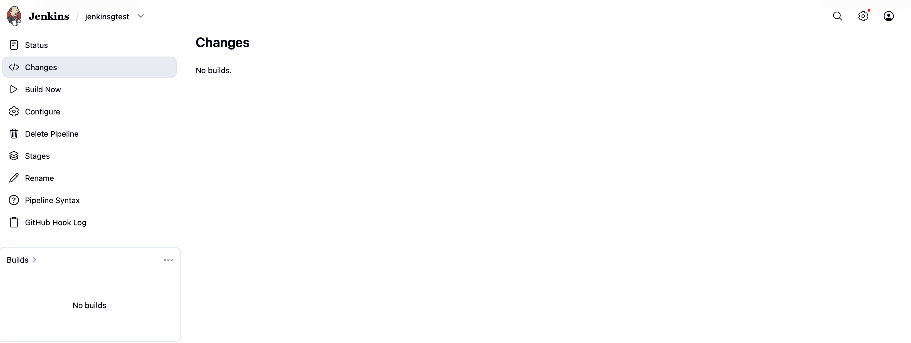
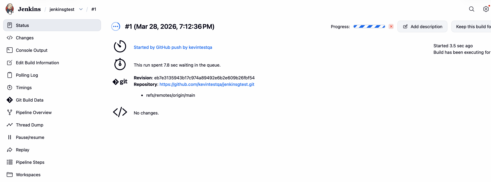
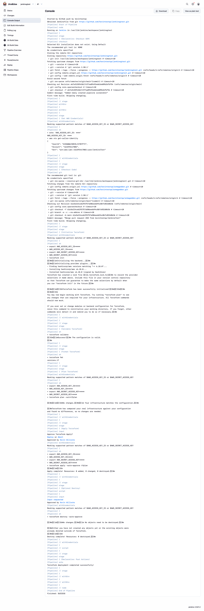
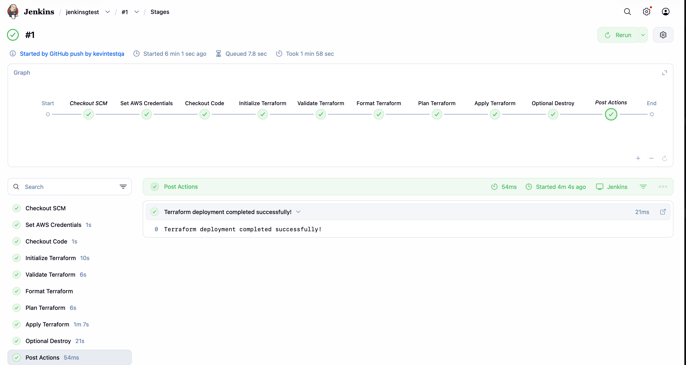
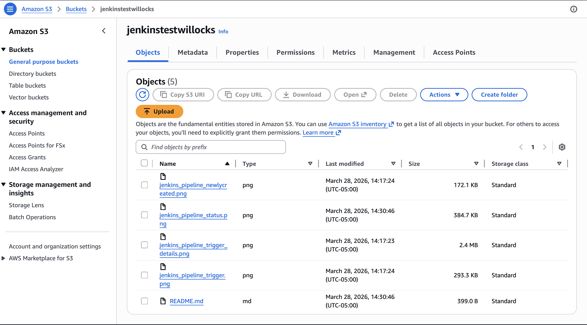

# Jenkins S3 Test

Repository: https://github.com/kevintestqa/jenkinsgtest.git

## Screenshots

### Pipeline created

https://jenkinstestwillocks.s3.us-east-1.amazonaws.com/jenkins_pipeline_newlycreated.png

### Pipeline trigger

https://jenkinstestwillocks.s3.us-east-1.amazonaws.com/jenkins_pipeline_trigger.png

### Trigger details

https://jenkinstestwillocks.s3.us-east-1.amazonaws.com/jenkins_pipeline_trigger_details.png

### Pipeline status

https://jenkinstestwillocks.s3.us-east-1.amazonaws.com/jenkins_pipeline_status.png

### S3 Bucket Contents

### Armageddon Place holder

https://jenkinstestwillocks.s3.us-east-1.amazonaws.com/Kiyomizu_min_.jpg